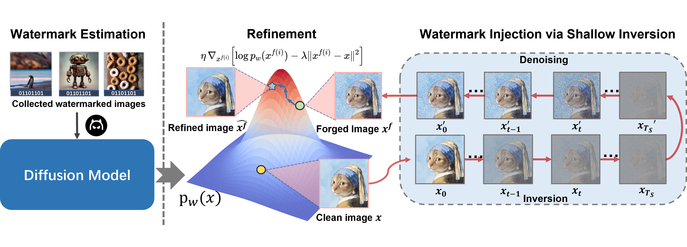

# WMCopier: Forging Invisible Image Watermarks on Arbitrary Images

This repository explores attacks against invisible watermarking schemes using diffusion models, providing practical tools for watermark forgery and evaluation.

<p align="center">
  
</p>

---

## 🚀 Getting Started

### 0. Install Requirements

First, create and activate a conda environment with **Python 3.9+**:

```bash
conda create -n wmcopier python=3.9
conda activate wmcopier
```
Then install all required dependencies:
```bash
pip install -r requirements.txt
```

### 1. Model Weights Configuration 📥

Several neural-network-based watermarking algorithms in this project require pretrained model weights.  
Please follow the instructions below to download the corresponding weights and place them in:

##### • DwTDCT, RivaGAN
DwTDCT is a classical, non–neural-network watermarking algorithm, while RivaGAN is a neural watermarking method.  
Both algorithms are integrated in this project by directly calling the Python API provided by: https://github.com/ShieldMnt/invisible-watermark.git

##### • HiDDeN  
Download from: https://github.com/ando-khachatryan/HiDDeN.git

##### • StegaStamp  
Download from: https://github.com/ningyu1991/ArtificialGANFingerprints.git

##### • Stable Signature  
Download from: https://github.com/facebookresearch/stable_signature

##### • Vine
This watermarking algorithm does not require manual weight preparation.  
When invoked for the first time, it will automatically download the required model weights from HuggingFace.

📁 Example Directory Structure (after downloading all weights)

```
WMSuite/algorithms/
└── checkpoints/
	├── hidden/
	│   ├── combined-noise--epoch-400.pyt
	│   ├── crop-epoch-300.pyt
	│   └── no-noise--epoch-400.pyt
	├── stable_signature/
	│   ├── dec_48b_whit.torchscript.pt
	│   ├── sd2_decoder.pth
	│   └── v2-1_512-ema-pruned.ckpt
	└── stegastamp/
		├── AFHQ_cat2dog_256x256_decoder.pth
		└── AFHQ_cat2dog_256x256_encoder.pth
```

### 2. Generate Watermarked Auxiliary Dataset

You can easily generate watermarked images by running:
```bash
bash WMSuite/emb.sh
```

We highly recommend using WMSuite as an independent repository to help with your own watermarking experiments.
👉 **https://github.com/holdrain/WMSuite.git**

WMSuite currently supports **six watermarking algorithms**:

- **HiDDeN**
- **DwTDCT**
- **RivaGAN**
- **StegaStamp**
- **VINE**
- **Stable Signature**


### 3. Train a diffusion attacker

Train the watermarked unconditional diffusion model:
```bash
bash scripts/train.sh
```

Alternatively, you can use our pretrained model (trained on 5,000 watermarked images). Download the checkpoint package from [Google Drive](https://drive.google.com/file/d/1uROeoV2l3dcyGCGS-vB3_pv_UXCKymEM/view?usp=sharing).

After downloading, unzip the file and place the extracted folders so that your project structure looks like:

```
-WMCopier
  -checkpoints
  -configs
  ...
```

### 4. Perform the Forgery Attack

You can try our forgery attack with a simple example on RivaGAN watermark by running the notebook: **`demo/forge.ipynb`**

For large-scale experiments on an entire image folder, run:

```bash
bash scripts/attack.sh
```

---
### 4. Attack on Real-World Watermark

We do not publish the checkpoints here, following discussions with Amazon’s AGI Team. For more details, please refer to the "Broad Impact" section in our paper.


## 🔗 Reference

- Training scripts for the diffusion model are based on the [HuggingFace Diffusers tutorial](https://huggingface.co/docs/diffusers/tutorials/basic_training).